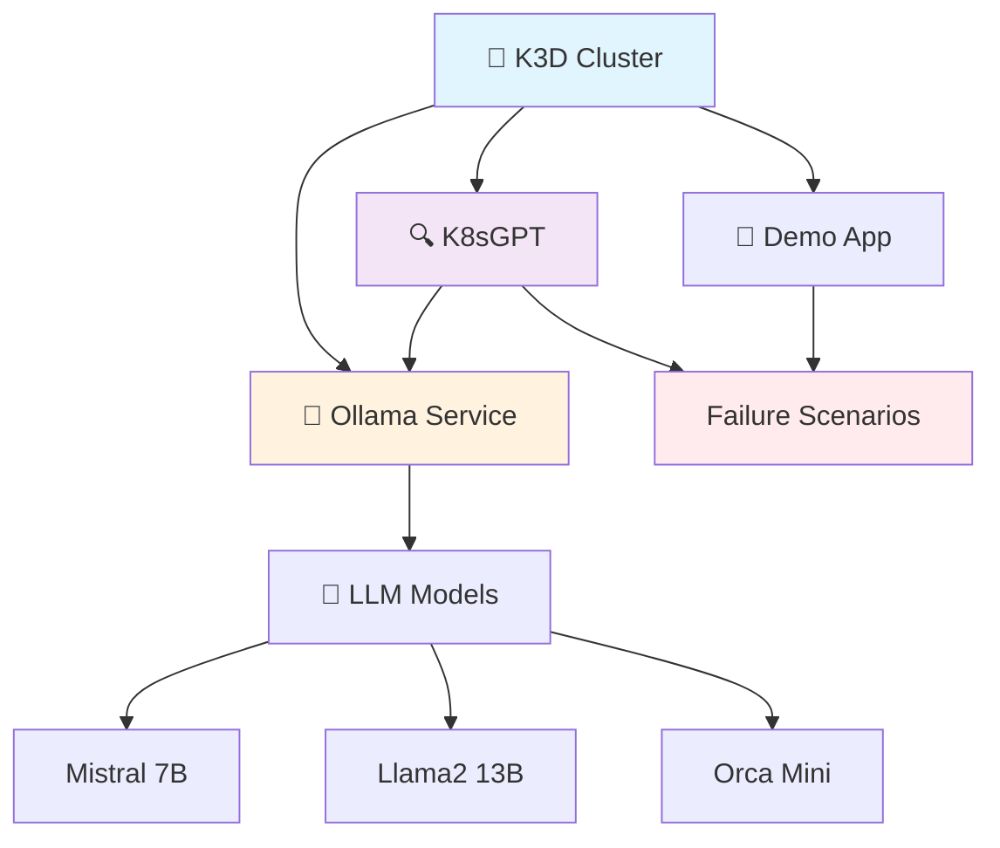

# 🎯 K8sGPT with Ollama on K3D: Complete Workshop & Demo

[](https://opensource.org/licenses/MIT)
[]
[]
[]

> A comprehensive demo project showcasing AI-powered Kubernetes troubleshooting using K8sGPT with Ollama running on local K3D clusters. Perfect for quick workshops, and learning!

This repository is designed for  **workshops**, and **educational demos**. Everything is automated with validation scripts and failure scenarios for live demonstrations.

## 🏗️ Workflow and Design



## 📁 Repository Structure

```
📦 cncf-pune-k8sgpt-demo/
├── 🚀 setup.sh                 # Main one-command setup script
├── 🛠️ scripts/
│   ├── install-k3d.sh          # K3D installation & cluster setup
│   ├── install-ollama.sh       # Ollama + LLM models installation
│   ├── install-k8sgpt.sh       # K8sGPT installation & configuration
│   ├── setup-demo.sh           # Demo environment setup
│   └── validate-setup.sh       # Validation script for all components
├── 📚 docs/
│   ├── 01-k3d-setup.md         # K3D cluster setup guide
│   └── 02-ollama-setup.md      # Ollama installation guide
├── 🎮 demo-app/
│   ├── src/                    # Demo application source
│   ├── k8s/                    # Kubernetes manifests
│   ├── deploy.sh              # App deployment script
│   ├── Dockerfile             # Container definition
│   └── README.md              # App documentation
├── 💥 scenarios/
│   ├── scenario-1/k8s/         # ImagePullBackOff demo files
│   ├── scenario-2/k8s/         # Service selector mismatch files
│   ├── scenario-3/k8s/         # PVC volume issue files
│   └── run-scenario.sh         # Scenario execution script
├── ⚙️ k8s/
│   └── k3d-cluster.yaml       # K3D cluster configuration
├── 📖 README.md               # This file - project overview
├── 📋 PROJECT_STRUCTURE.md    # Detailed project structure guide
└── 🙈 .gitignore              # Git ignore patterns
```

## 🚀 Quick Start (5 minutes)

### One-Command Setup (Recommended)
```bash
git clone https://github.com/yourusername/cncf-pune-k8sgpt-demo.git
cd cncf-pune-k8sgpt-demo
./setup.sh
```

### Step-by-Step Setup (Advanced)
```bash
# 1. Install K3D and create cluster
./scripts/install-k3d.sh

# 2. Install Ollama and download models
./scripts/install-ollama.sh

# 3. Install and configure K8sGPT
./scripts/install-k8sgpt.sh

# 4. Deploy demo application
./scripts/setup-demo.sh --skip-install

# 5. Validate everything is working
./scripts/validate-setup.sh
```

### K3D Automation Options
```bash
# Force recreate cluster (non-interactive)
./scripts/install-k3d.sh --force-recreate

# Use existing cluster if found (non-interactive)
./scripts/install-k3d.sh --use-existing

# Interactive mode (default - asks user what to do)
./scripts/install-k3d.sh
```

### Validation Only
```bash
./setup.sh --validate
```

### For Existing Installations

The setup scripts are designed to work with existing installations:

- **K8sGPT already installed?** ✓ Setup will skip installation and only configure it
- **Ollama already running?** ✓ Setup will skip installation and only download missing models  
- **K3D cluster exists?** ✓ Setup will ask whether to delete/recreate or use existing cluster

> 📝 **Note:** If you already have k8sgpt installed (e.g., via Homebrew), the setup script will detect it and skip the installation step, proceeding directly to configuration with Ollama.

## 🎯 Demo Scenarios

The project includes 3 failure scenarios perfect for live demonstrations:

| Scenario | Issue Type | Demo Purpose |
|----------|------------|-------------|
| **Scenario 1** | `ImagePullBackOff` | Show K8sGPT detecting image issues |
| **Scenario 2** | Service Selector Mismatch | Demonstrate networking problems |
| **Scenario 3** | PVC Volume Issue | Show persistent volume claim problems |

```bash
# Run individual scenarios
./scenarios/run-scenario.sh 1  # ImagePullBackOff
./scenarios/run-scenario.sh 2  # Service mismatch
./scenarios/run-scenario.sh 3  # PVC volume issue
```

## 🛠️ Prerequisites

- **macOS** (tested on macOS Monterey+)
- **Homebrew** package manager
- **Docker Desktop** (4GB+ RAM recommended)
- **10GB+ free disk space** (for LLM models)
- **Internet connection** (for downloading models)

## 📋 What Gets Installed

| Component | Description | Installation Method | Notes |
|-----------|-------------|--------------------|---------|
| **K3D** | Lightweight K8s in Docker | Homebrew | Skipped if already installed |
| **kubectl** | Kubernetes CLI | Homebrew | Skipped if already installed |
| **Ollama** | Local LLM runner | Homebrew | Skipped if already installed |
| **K8sGPT** | AI K8s troubleshooter | Homebrew | **Skipped if already installed** |
| **Mistral 7B** | Fast, efficient model | Ollama pull | Skipped if already downloaded |
| **Llama2 13B** | More capable model | Ollama pull | Skipped if already downloaded |
| **Orca Mini** | Lightweight model | Ollama pull | Skipped if already downloaded |

## 🧪 Validation & Testing

```bash
# Complete validation
./scripts/validate-setup.sh

# Individual component checks
kubectl get nodes                    # Check K3D cluster
curl http://localhost:11434/api/tags # Check Ollama models
k8sgpt version                       # Check K8sGPT installation
```

## 🔧 Troubleshooting Existing Installations

### K8sGPT Configuration Issues

If you have k8sgpt already installed but it's not configured for Ollama:

```bash
# Check current authentication
k8sgpt auth list

# Remove existing configuration
k8sgpt auth remove --backends ollama

# Reconfigure with Ollama
./scripts/install-k8sgpt.sh
```

### Mixed Installation Sources

If you have components installed via different methods (Homebrew vs manual), you may need to:

```bash
# Check what's installed where
which k8sgpt    # Should show /opt/homebrew/bin/k8sgpt or similar
which ollama    # Should show /opt/homebrew/bin/ollama or similar

# If paths look wrong, consider reinstalling via Homebrew
brew uninstall k8sgpt && brew install k8sgpt
```

### K3D Cluster Issues

If you have issues with existing K3D clusters:

```bash
# List all K3D clusters
k3d cluster list

# Delete specific cluster
k3d cluster delete cncf-pune-k3d-demo

# Recreate cluster automatically
./scripts/install-k3d.sh --force-recreate

# Or use existing cluster without prompting
./scripts/install-k3d.sh --use-existing
```

## 🌟 Key Features

- ✅ **Fully Automated**: One-command setup for demos
- 🔄 **Repeatable**: Clean teardown and setup scripts
- 🎯 **Educational**: Real-world failure scenarios
- 📖 **Well Documented**: Step-by-step guides
- 🧪 **Validated**: Automated testing pipeline
- 🎤 **Speaker Ready**: Complete presentation materials

## 🤝 Contributing

Contributions welcome! Please read our [Contributing Guide](CONTRIBUTING.md) first.

1. Fork the repository
2. Create your feature branch (`git checkout -b feature/amazing-feature`)
3. Commit your changes (`git commit -m 'Add amazing feature'`)
4. Push to the branch (`git push origin feature/amazing-feature`)
5. Open a Pull Request

## 📞 Support & Contact

- **LinkedIn**: [Vinay Gattu LinkedIn](https://www.linkedin.com/in/vinayga2/)


## 🙏 Acknowledgments

- [CNCF Pune](https://community.cncf.io/pune/) community
- [K8sGPT](https://github.com/k8sgpt-ai/k8sgpt) team
- [Ollama](https://ollama.ai) project
- [K3D](https://k3d.io) maintainers

---

⭐ **Star this repo** if you found it useful for your speaker sessions or learning!
